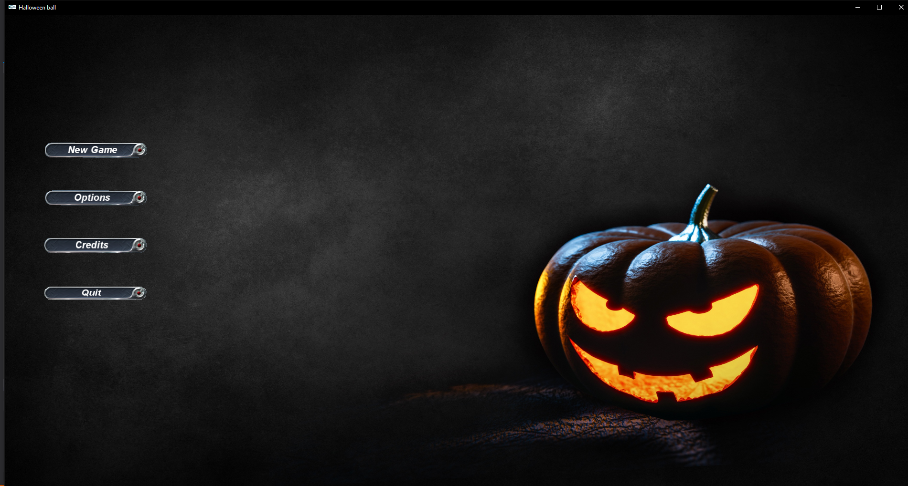
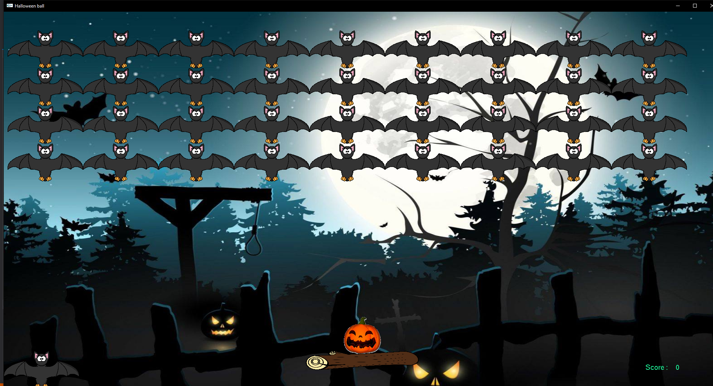
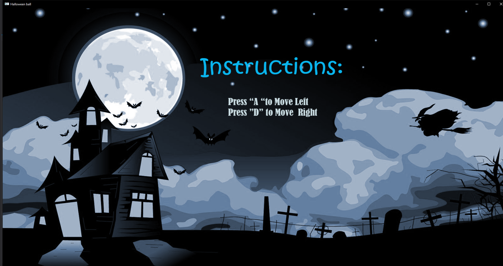

# DxBallHalooweenVersion
This repository contains a mini game create by me ,inspired from classic title game :Dx Ball 

 
<strong>IDE: </strong> Visual studio 13 ultimate,codeblocks
 
<strong>Language:</strong> C,C++
 
<strong>Game Description: </strong> It's a dx ball type game instead of ball you'll throw pumpkins and instead of bricks u"ll break bats.The more bats you kill the higher your score goes!
 

